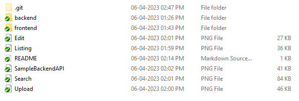
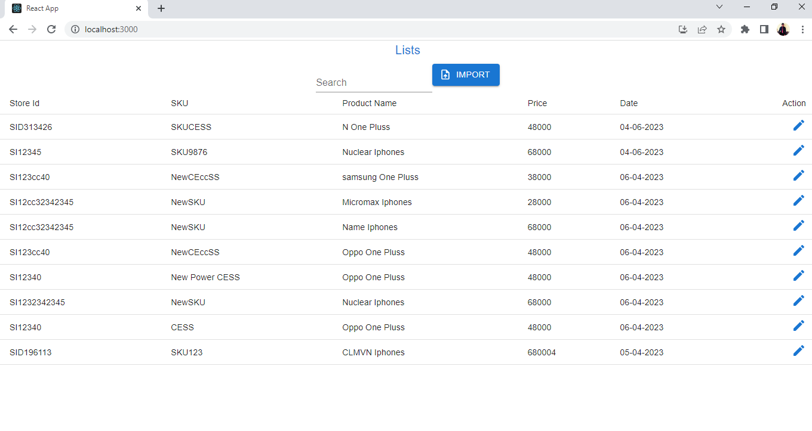
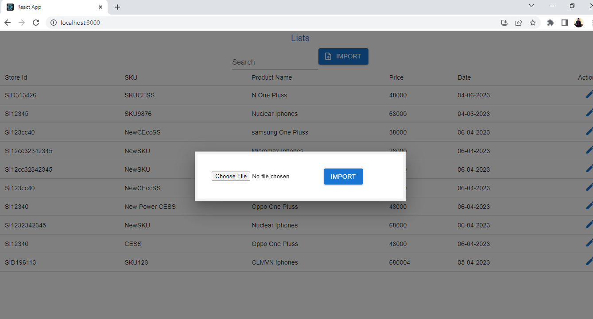
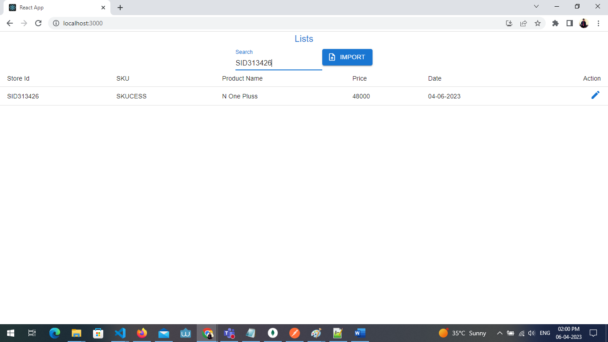
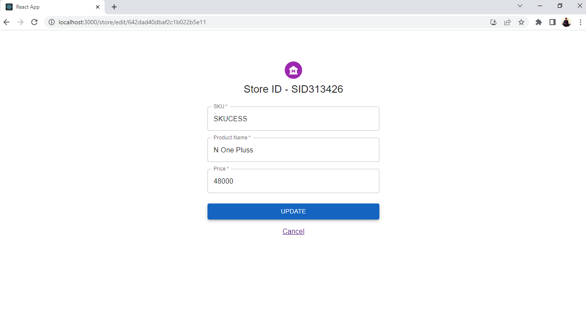
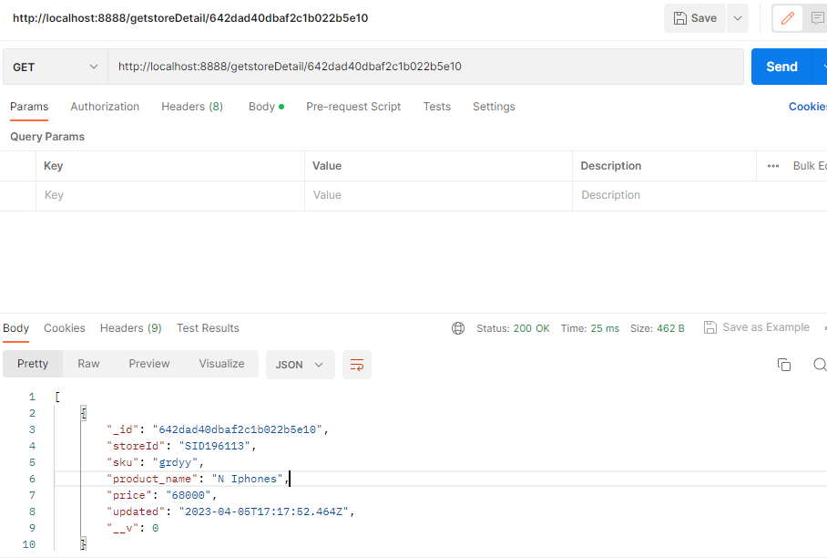

# Folder structure

## Prerequisites
Install Mongo DB and create Database
Install [nodemon](https://www.npmjs.com/package/nodemon)

## Available Scripts

In Both Frontend and backend the project directory, you can run:

### `npm install`
## Launch the Application
### `npm start`

## Sample OUTPUT

